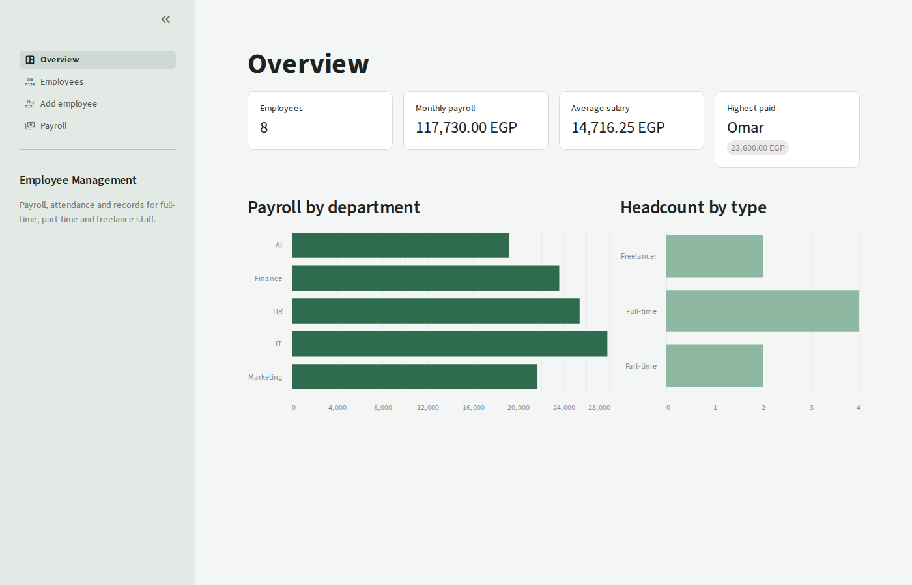
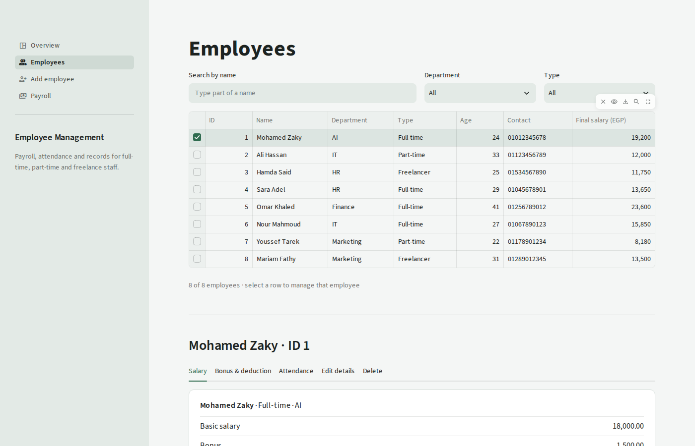
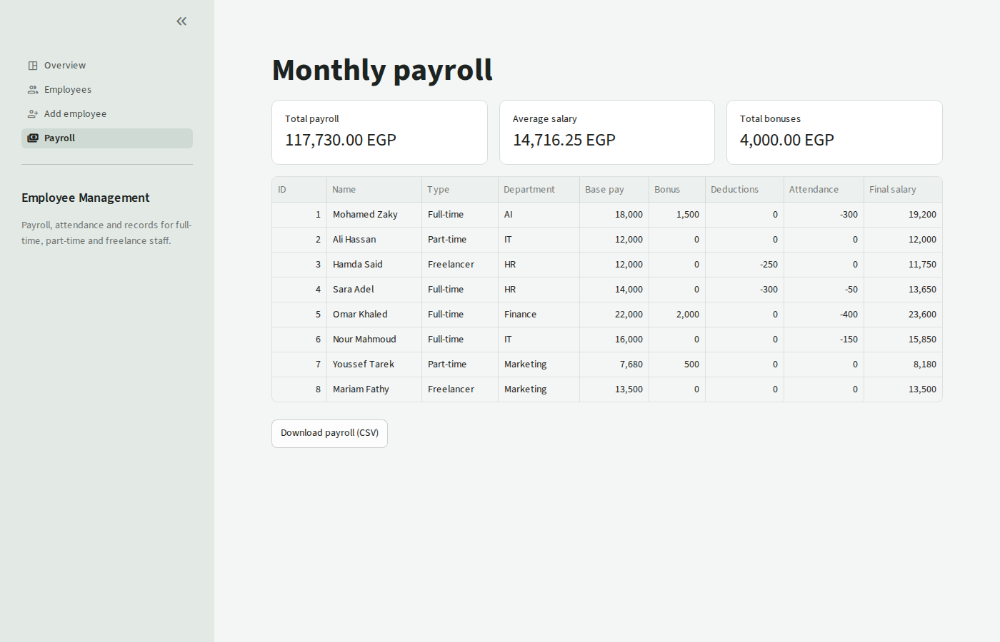

# Employee Management System

A payroll and HR records system for a small company with three kinds of staff: full-time, part-time and freelancers. It comes with two interfaces that share the same logic:

- **Web dashboard** (Streamlit): overview, searchable employee table, payroll report with CSV export.
- **Console app**: the original menu-driven program.



## Features

- Add, edit and delete employees, with validation (unique IDs, valid ages, positive pay rates)
- Search and filter by name, department and employee type
- Three pay models:
  - **Full-time**: monthly salary, minus 200 EGP per absent day and 50 EGP per late day
  - **Part-time**: hourly rate × hours worked
  - **Freelancer**: rate per project × completed projects
- Bonuses and deductions for any employee
- Attendance tracking (absences, late days, hours, completed projects)
- Salary slip per employee and a monthly payroll report
- Statistics: headcount by type and department, total and average payroll
- Data is saved automatically to `employee_data.json`

| Employees | Payroll |
|---|---|
|  |  |

## Run it

Requires Python 3.9+.

```bash
git clone https://github.com/mohamedazaky/employee-management-system.git
cd employee-management-system
pip install -r requirements.txt
```

Web dashboard:

```bash
streamlit run app.py
```

Console version:

```bash
python main.py
```

## Project structure

```
├── app.py                  # Streamlit web dashboard
├── main.py                 # Console menu
├── employee_functions.py   # All business logic: CRUD, salary rules, search, file storage
├── employee_data.json      # Sample data (8 employees)
├── .streamlit/config.toml  # Dashboard theme
└── requirements.txt
```

## Built with

Python, Streamlit, pandas, JSON file storage.
